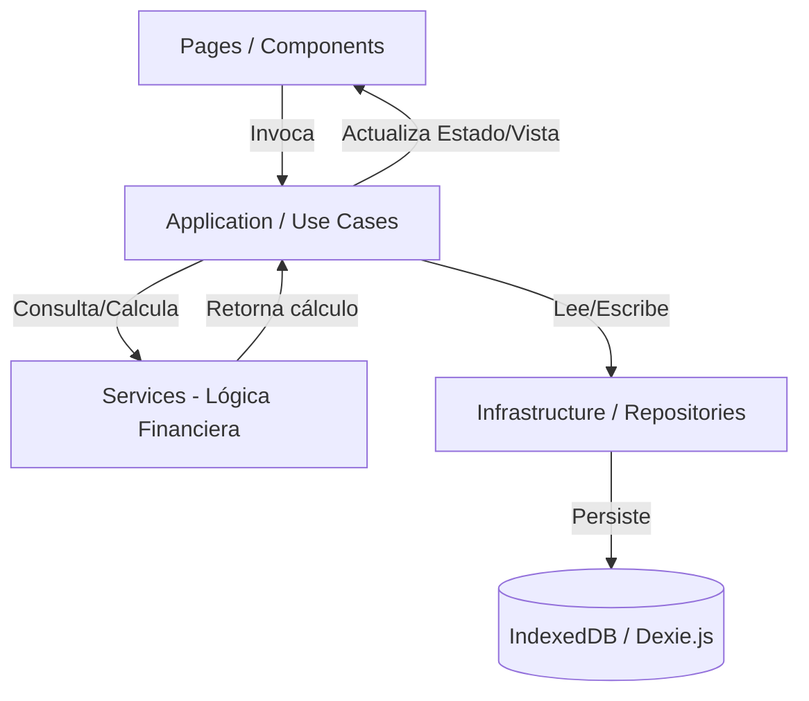

# Plan de Implementación: PWA de Finanzas Personales Offline

Este documento detalla la arquitectura, el diseño técnico y el plan de implementación para la Progressive Web App (PWA) de finanzas personales. La aplicación está diseñada para funcionar 100% offline, almacenando datos localmente en IndexedDB mediante Dexie.js, y estructurada bajo principios de Clean Architecture en JavaScript Vanilla (ES2023).

---

## 1. Arquitectura de Software

Implementaremos una versión simplificada de **Clean Architecture** adaptada a JavaScript Vanilla. Esto mantendrá la lógica de negocio desacoplada de los detalles de la interfaz de usuario (DOM) y de la persistencia (IndexedDB).

### Estructura de Directorios (Módulos Desacoplados)

```text
/src
├── /assets           # Iconos, imágenes, splash screens
├── /config           # Configuración del sistema, constantes de temas y esquemas
├── /styles           # Hojas de estilo globales, variables de Material Design 3 (M3)
├── /utils            # Funciones utilitarias (formateo de fechas, números, hashing)
├── /core             # Reglas de negocio globales, núcleo de Clean Architecture
├── /domain           # Entidades (Modelos) y contratos de Repositorios (Interfaces implícitas)
│   ├── /entities     # Account, Transaction, Debt, Goal, Snapshot, Settings
│   └── /repositories # Interfaces de persistencia
├── /storage          # Configuración de Dexie.js, inicialización de DB, migraciones
├── /infrastructure   # Implementación concreta de Repositorios y Servicios Externos
│   ├── /repositories # Implementación Dexie de repositorios
│   └── /pwa          # Configuración del Service Worker y Manifest
├── /services         # Lógica financiera pura (Calculadoras, Agregadores, Importadores)
├── /application      # Casos de uso (coordinan Servicios, Repositorios y modifican Estado)
├── /components       # UI Components reutilizables (Card, Chart, Dialog, Table, Alert)
└── /pages            # Controladores de página que orquestan los componentes y casos de uso
```

### Flujo de Datos



---

## 2. Base de Datos (IndexedDB con Dexie.js)

La base de datos local se llamará `MagiFinanceDB`. Definiremos los almacenes (stores) con los índices necesarios para consultas eficientes (rango de fechas, filtros por categoría, etc.).

### Esquema y Migraciones (`src/storage/db.js`)

```javascript
import Dexie from 'dexie';

export const db = new Dexie('MagiFinanceDB');

// Esquema Versión 1
db.version(1).stores({
  snapshots: '++id, date, createdAt',
  transactions: '++id, date, type, category, snapshotId, debtId, paymentMethod',
  accounts: 'id, name, type, isActive',
  creditCards: 'id, name',
  debts: 'id, name, status',
  settings: 'key',
  backups: '++id, date, createdAt'
});
```

*Nota: La información nunca se sobrescribe. Cada importación de Snapshot añade un registro a `snapshots`. Los saldos se calculan acumulando transacciones desde el último Snapshot válido.*

---

## 3. Lógica de Agregación Financiera (Cálculo del Estado Actual)

Dado que un **Snapshot** representa una foto fija en una fecha $T_s$, y los **Movimientos** (Transactions) ocurren en fechas $T_t$, el estado actual (o en cualquier fecha $T_query$) se calcula mediante:

$$\text{Saldo Cuenta } A = \text{Saldo } A \text{ en Snapshot más reciente } (T_s \le T_query) + \sum \text{Transacciones en } A \text{ desde } T_s \text{ hasta } T_query$$

### Reglas de Operación por Tipo de Transacción
- `income` (Ingreso): Incrementa el saldo de la cuenta/método de pago.
- `expense` (Gasto): Reduce el saldo de la cuenta/método de pago.
- `transfer` (Transferencia): Reduce la cuenta de origen (`paymentMethod`) e incrementa la cuenta de destino (`destinationAccount`).
- `debt_payment` (Pago de Deuda): Reduce la cuenta de origen e incrementa el progreso de pago de la deuda (reduce pasivo).
- `adjustment` (Ajuste): Sobrescribe o ajusta directamente el saldo por conciliación.

---

## 4. Smart JSON Importer (Importador Inteligente)

Para evitar duplicados y asegurar la calidad de la información, el servicio de importación realizará las siguientes validaciones:
1. **Esquema e Integridad**: Verificar presencia de campos obligatorios (`version`, `type`, `date`, `data`).
2. **Duplicados**: Comprobar si ya existe un Snapshot con la misma fecha (`date`) o transacciones con la misma firma de datos (monto, fecha, descripción, cuenta).
3. **Validación semántica**: Confirmar que los métodos de pago referenciados en las transacciones existan en las cuentas activas del sistema.
4. **Previsualización**: Antes de guardar, mostrar un modal de resumen detallando:
   - Número de registros nuevos.
   - Registros duplicados omitidos.
   - Variación estimada en el patrimonio neto.

---

## 5. Diseño UX/UI (Material Design 3)

La aplicación usará un diseño moderno, inspirado en Apple Wallet, Google Wallet, Notion y Material You (M3), con soporte nativo para **Modo Claro / Modo Oscuro**.

### Ficheros de Estilos (`src/styles/`)
- `variables.css`: Paleta de colores M3 (Tokens HSL/Hex), tipografía (Inter/Outfit), sombras y radios de curvatura.
- `main.css`: Estilos globales y reset.
- `components.css`: Estilos comunes para tarjetas (glassmorphism/neumorphism sutil), botones, tablas, modales y barras de navegación.

### Componentes UI Reutilizables
- **NavRail / BottomNav**: Navegación lateral en escritorio y barra inferior en móviles (Mobile First).
- **MetricCard**: Tarjetas visuales de KPIs con indicadores de tendencia (positivo/negativo).
- **FinanceChart**: Wrapper para gráficos dinámicos interactivos utilizando `Chart.js`.
- **TransactionRow**: Filas interactivas en el historial con microinteracciones al pasar el ratón (hover) y clics para edición.

---

## 6. Configuración de PWA Offline

Para asegurar un funcionamiento 100% offline sin backend:
1. **Manifest de la App** (`public/manifest.json`): Configurar nombre de la app, colores, iconos y modo de despliegue independiente (standalone).
2. **Service Worker** (`src/infrastructure/pwa/sw.js`):
   - Estrategia *Cache First* para recursos estáticos (CSS, JS, Fonts).
   - Estrategia *Network First* o *Stale-While-Revalidate* para librerías externas de CDN (como Google Fonts).
   - Registro de actualizaciones en segundo plano para notificar al usuario cuando haya una nueva versión disponible.

---

## 7. Plan de Implementación (Fases)

### Fase 1: Estructura del Proyecto y Configuración
- [ ] Inicializar proyecto con Vite Vanilla JS.
- [ ] Instalar dependencias (`dexie`, `chart.js`, `dayjs`).
- [ ] Crear la estructura de directorios descrita.
- [ ] Configurar variables de diseño (Material You CSS) y temas.

### Fase 2: Persistencia (Storage y Domain)
- [ ] Implementar inicialización de la base de datos `db.js` en Dexie.
- [ ] Crear Entidades y Repositorios para `Snapshots`, `Transactions`, `Accounts`, `Debts`, `Goals` y `Settings`.
- [ ] Programar lógica de inicialización y migración.

### Fase 3: Servicios Financieros e Importador Smart
- [ ] Implementar el motor de cálculo de saldos consolidados (Snapshot + Delta de Transacciones).
- [ ] Desarrollar el `ImportExportService` con validador de integridad y detección de duplicados.
- [ ] Diseñar el JSON esquema base para snapshots y transacciones.

### Fase 4: Vistas UI y Componentes (Vanilla JS)
- [ ] **Router**: Implementar router por hash (`#/dashboard`, etc.) de forma reactiva.
- [ ] **Layout**: Diseñar estructura global responsiva (Header, Navigation, Main Area).
- [ ] **Dashboard**: Mostrar KPIs, gráficos de tendencia, ingresos/gastos y balances agregados.
- [ ] **Timeline**: Historial de snapshots con módulo de comparación.
- [ ] **Transactions**: Tabla con filtros de búsqueda avanzada, agregar manual y modal de importación JSON.
- [ ] **Accounts & Debts & Goals**: Vistas específicas para administrar activos, pasivos y metas.
- [ ] **Settings**: Opciones de exportar/importar BD completa, alternar modo claro/oscuro y vaciado.

### Fase 5: Service Worker, PWA y GitHub Pages
- [ ] Configurar plugin de PWA de Vite y service worker offline.
- [ ] Crear scripts de compilación automática.
- [ ] Preparar para despliegue en GitHub Pages (ajuste de rutas relativas).

---

## 8. Plan de Verificación

### Pruebas Automatizadas
Utilizaremos scripts locales de prueba (en `scratch/`) para validar:
- La lógica matemática de agregación (Snapshot de origen + 5 transacciones = saldo esperado).
- El parser de importación (casos con JSON corrompido, duplicados y esquemas incorrectos).

### Verificación Manual
- **Simulación Offline**: Probar la app en modo offline desde las herramientas de desarrollo de Chrome (Network -> Offline) y verificar que las operaciones de consulta y guardado funcionan sin retraso ni errores.
- **Instalación PWA**: Probar la instalación en escritorio y en un dispositivo móvil Android/iOS.
- **Rendimiento**: Verificar tiempos de respuesta con más de 1000 transacciones simuladas en IndexedDB.

---

## 9. Preguntas Abiertas para el Usuario

> [!IMPORTANT]
> 1. **Esquema de Cuentas por Defecto**: ¿Prefiere que inicialicemos la base de datos con algunas cuentas preconfiguradas (e.g., BBVA, Nu, Efectivo) al abrir por primera vez la app?
> 2. **Moneda Base**: ¿Trabajaremos principalmente con pesos mexicanos (MXN) u otra moneda por defecto? ¿Es necesario soportar multimoneda en la primera versión?
> 3. **Estructura del JSON de Entrada**: ¿Desea que definamos una plantilla JSON exacta para que pueda alimentar sus prompts en ChatGPT y generar datos compatibles?
